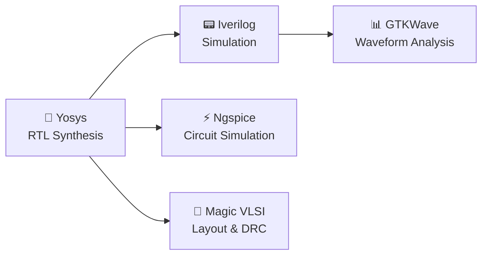

---


# 🚀 Week 0: VLSI System Design (VSD) Program Foundation & Tool Setup  
**VLSI Week Status**

Welcome to my **VLSI System Design (VSD) Program** repository!  
This week focused on setting up the development environment and installing the essential **open-source tools** that will be used throughout the program.  
The goal was to create a **reliable and efficient workspace** for synthesis, simulation, and design tasks.  

---

## 🎯 System and Virtual Machine Configuration
To ensure optimal performance, I configured a Virtual Machine (VM) with the following specifications:  

| Specification 💻 | Details 📋  |
|------------------|-------------|
| Operating System 🐧 | Ubuntu 20.04+ |
| RAM 💾 | 6GB |
| Storage 💿 | 50GB HDD |
| vCPUs ⚡ | 4 |

💡 **Pro Tip**: This setup guarantees sufficient resources for handling toolchain demands and running simulations smoothly.  

---

## ⚙️ Tool Installation & Verification

The following tools were installed for **RTL synthesis, simulation, circuit analysis, and layout design.**  
Below are the installation steps and verification commands.  

### 🧠 1. Yosys – RTL Synthesis Tool
**Purpose:** Converts RTL code into gate-level representations.  

```bash
# Installation
git clone https://github.com/YosysHQ/yosys.git
cd yosys 
sudo apt install make
sudo apt-get install build-essential clang bison flex \
  libreadline-dev gawk tcl-dev libffi-dev git \
  graphviz xdot pkg-config python3 libboost-system-dev \
  libboost-python-dev libboost-filesystem-dev zlib1g-dev
make 
sudo make install
````

✅ **Successfully Installed**

---

### 📟 2. Iverilog – Verilog Simulator

**Purpose:** Compiles and simulates Verilog designs for functional verification.

```bash
sudo apt-get install iverilog
```

✅ **Successfully Installed**

---

### 📊 3. GTKWave – Waveform Viewer

**Purpose:** Analyzes and visualizes simulation waveforms for debugging.

```bash
sudo apt update
sudo apt install gtkwave
```

✅ **Successfully Installed**

---

### ⚡ 4. Ngspice – Circuit Simulator

**Purpose:** Performs analog and mixed-signal circuit simulation.

```bash
sudo apt update
sudo apt install ngspice
```

✅ **Successfully Installed**

---

### 🎨 5. Magic VLSI – Layout Tool

**Purpose:** Creates, edits, and analyzes VLSI layouts with DRC capabilities.

```bash
# Install dependencies
sudo apt-get install m4 tcsh csh libx11-dev tcl-dev tk-dev \
  libcairo2-dev mesa-common-dev libglu1-mesa-dev libncurses-dev

# Clone & Build
git clone https://github.com/RTimothyEdwards/magic
cd magic
./configure
make
sudo make install
```

✅ **Successfully Installed**

---

## 🎉 Installation Summary

| Tool          | Status     | Primary Use        |
| ------------- | ---------- | ------------------ |
| 🧠 Yosys      | ✅ Complete | RTL Synthesis      |
| 📟 Iverilog   | ✅ Complete | Verilog Simulation |
| 📊 GTKWave    | ✅ Complete | Waveform Analysis  |
| ⚡ Ngspice     | ✅ Complete | Circuit Simulation |
| 🎨 Magic VLSI | ✅ Complete | Layout Design      |

---

## 📊 Toolchain Flow (Mermaid Diagram)



---

## 🚀 Environment Ready for VLSI Design Journey!


📚 Program: **VLSI System Design (VSD)**


